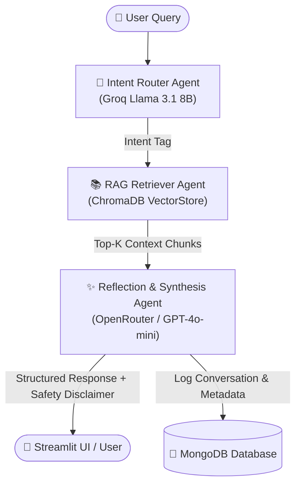

# 🏥 Sri Lankan Hospital Appointment Assistant

An intelligent, multi-agent Retrieval-Augmented Generation (RAG) assistant designed to simplify medical appointments, specialist matching, hospital navigation, and channelling service procedures (eChannelling, Doc990) across Sri Lanka.

---

## 📌 Project Overview
Navigating the healthcare system in Sri Lanka—whether finding the appropriate medical specialist, understanding booking policies across private providers (Asiri, Lanka Hospitals, Nawaloka, Durdans, Hemas, Suwasewana), or learning government hospital (NHSL) referral procedures—can be confusing for patients.

This project provides an AI-powered appointment assistant utilizing **LangGraph Multi-Agent Workflows**, **ChromaDB Vector Retrieval**, **Groq Fast Routing**, **OpenRouter Synthesis**, and **MongoDB Chat Persistence** to deliver precise, context-aware guidance with built-in emergency disclaimers.

---

## 🏗️ Agentic Design Patterns Used

1. **Router Pattern (`src/agents.py` - `router_agent`)**:
   - Classifies incoming user queries into discrete intent categories (`APPOINTMENT_PROCEDURE`, `SPECIALIST_MATCH`, `HOSPITAL_INFO`) using ultra-fast Groq Llama 3.1 8B inference.
2. **Tool-Use / RAG Pattern (`src/rag_pipeline.py` & `rag_retriever_agent`)**:
   - Performs semantic similarity search against a 20-file local ChromaDB vector store containing domain-specific Sri Lankan medical, hospital, and channelling knowledge.
3. **Reflection & Guardrail Pattern (`src/agents.py` - `synthesis_agent`)**:
   - Synthesizes retrieved context with the user query, formats structured recommendations, and enforces safety guardrails by appending mandatory Suwa Seriya 1990 emergency disclaimers.

---

## 🔄 Agent-to-Agent Communication Diagram



---

## 📊 Model Selection Justification Table

| Sub-task | Model (Provider) | Why Chosen |
| :--- | :--- | :--- |
| **Intent Classification** | `llama-3.1-8b-instant` (Groq) | Sub-100ms ultra-low latency, high throughput, zero token cost for fast routing. |
| **Final Synthesis & Advice** | `openai/gpt-4o-mini` / `claude-3.5-sonnet` (OpenRouter) | Superior reasoning, context synthesis, high safety compliance, clear formatting. |

---

## 🧪 5-Query RAG Evaluation Table

| Query | Retrieved Document | Relevant? | Comment |
| :--- | :--- | :--- | :--- |
| **How to book via eChannelling?** | `08_echannelling_faq.txt` | Yes | Retrieved step-by-step payment and booking guide. |
| **Who to see for chest pain?** | `12_specialist_cardiology.txt` | Yes | Matched cardiologist & emergency caution for heart symptoms. |
| **Nawaloka OPD hours?** | `03_nawaloka_hospitals.txt` | Yes | Returned accurate 24/7 OPD timings and specialist clinic hours. |
| **What is 1990 number?** | `17_emergency_1990.txt` | Yes | Correctly retrieved Suwa Seriya free ambulance hotline details. |
| **eZ Cash payment for appointments?** | `10_payment_methods.txt` | Yes | Accurately detailed mobile wallet and add-to-bill payment steps. |

---

## 🐳 Docker & MongoDB Architecture

The project is containerized with Docker & Docker Compose:
- **`app` container**: Streamlit application running on port `8501`.
- **`mongo` container**: MongoDB 7.0 database running on port `27017` with persistent Docker volume `mongo_data`.
- **`mongo-express` container**: Web GUI for MongoDB management running on port `8081`.

---

## 📁 Repository Structure

```
sri-lankan-hospital-assistant/
├── Dockerfile
├── docker-compose.yml
├── .dockerignore
├── .gitignore
├── README.md
├── requirements.txt
├── app.py
├── data/
│   ├── 01_asiri_hospitals.txt
│   ├── 02_lanka_hospitals.txt
│   ├── ... (20 domain text files)
│   └── 20_lab_reports_collection.txt
└── src/
    ├── __init__.py
    ├── database.py
    ├── rag_pipeline.py
    └── agents.py
```

---

## 🚀 How to Run

### Method 1: Using Docker Compose (Recommended)

```bash
# 1. Set environment variables (or enter in Streamlit sidebar)
export GROQ_API_KEY="your-groq-api-key"
export OPENROUTER_API_KEY="your-openrouter-api-key"

# 2. Build and launch containers
docker-compose up --build
```
- Open Web Assistant: `http://localhost:8501`
- Open Mongo Express DB Manager: `http://localhost:8081`

### Method 2: Local Python Execution

1. **Clone & Virtual Environment:**
   ```bash
   python -m venv venv
   # Windows:
   venv\Scripts\activate
   # macOS/Linux:
   source venv/bin/activate
   ```

2. **Install Dependencies:**
   ```bash
   pip install -r requirements.txt
   ```

3. **Launch Streamlit App:**
   ```bash
   streamlit run app.py
   ```

---

## ☁️ Streamlit Cloud Deployment Instructions

1. Push your code to a public repository on **GitHub**.
2. Go to **[share.streamlit.io](https://share.streamlit.io)** and log in with your GitHub account.
3. Select your repository, branch (`main`), and set Main file path to `app.py`.
4. In **Advanced Settings -> Secrets**, enter your keys:
   ```toml
   GROQ_API_KEY = "gsk_..."
   OPENROUTER_API_KEY = "sk-or-v1-..."
   ```
5. Click **Deploy!**
